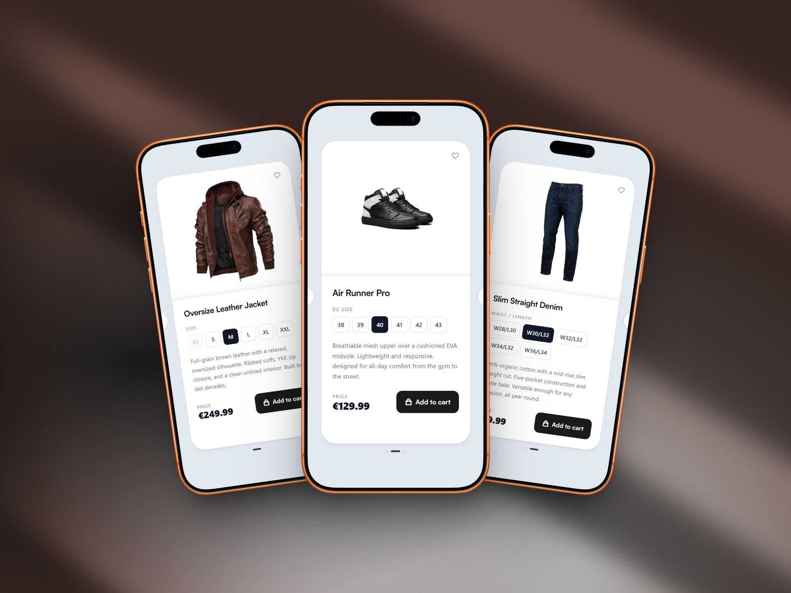
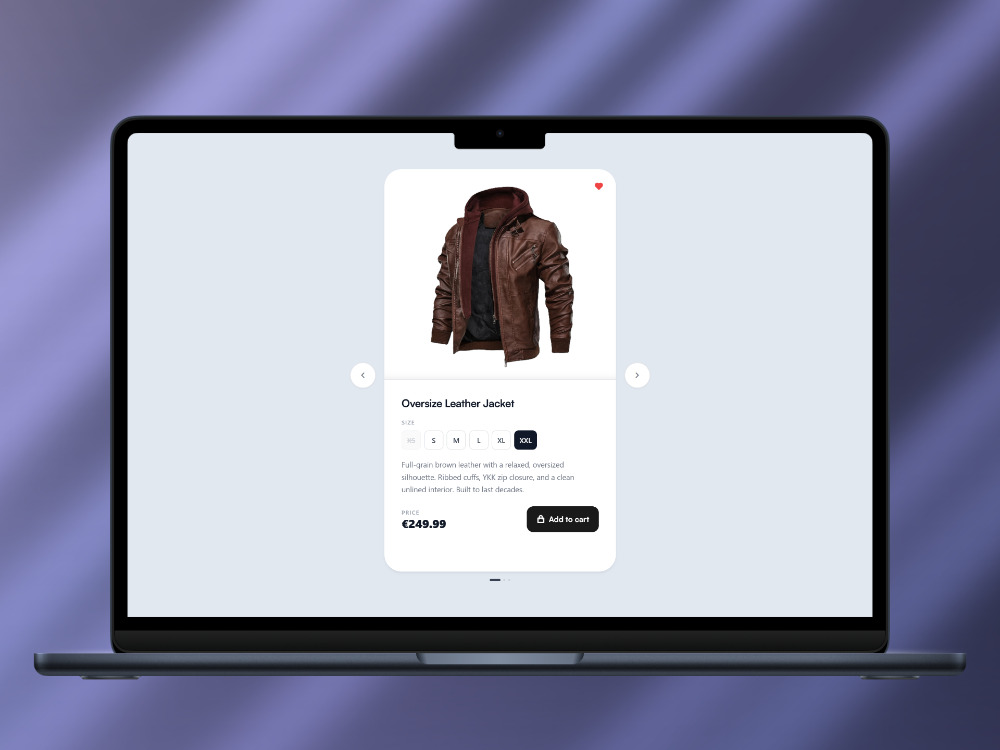
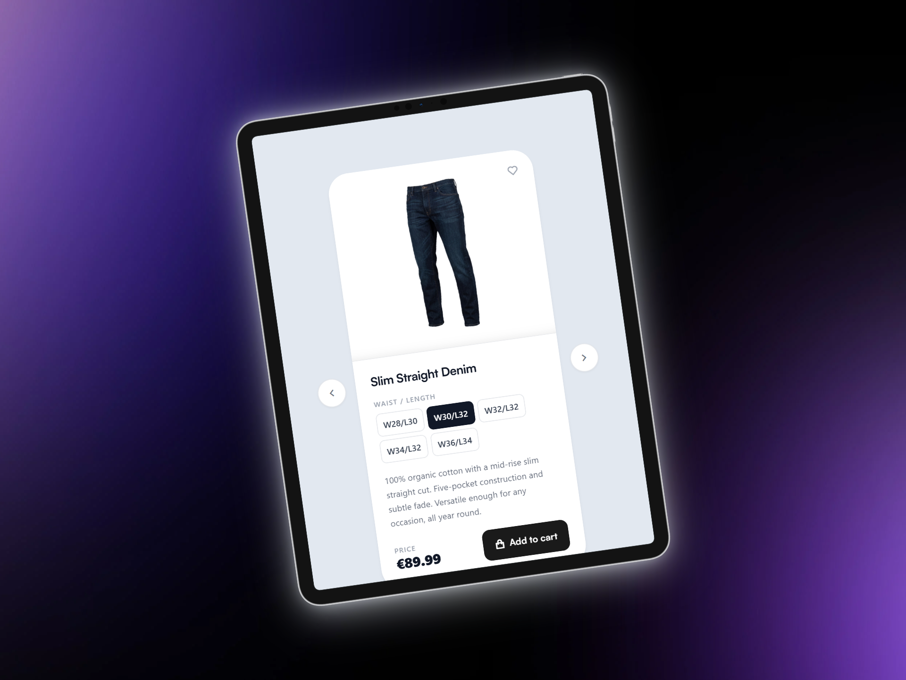

# Product Cards


A responsive product card carousel built with vanilla HTML, CSS, and JavaScript. Displays three fashion items with size selection, a favorite toggle, and full touch/swipe support. No frameworks, no dependencies beyond CDN-hosted fonts and icons.

---

## Table of Contents

- [About](#about)
- [Features](#features)
- [Tech Stack](#tech-stack)
- [Screenshots](#screenshots)
- [Getting Started](#getting-started)
- [Project Structure](#project-structure)
- [Accessibility](#accessibility)
- [License](#license)
- [Contact](#contact)

---

## About

Product Cards is a frontend UI component built as part of a frontend development portfolio. It covers common e-commerce patterns: a paginated product carousel, per-card size selectors with unavailable state handling, a favorite toggle, and an add-to-cart button. The layout is fully responsive and works on mobile, tablet, and desktop without any JavaScript framework.

---

## Features

- Carousel navigation with previous/next arrow buttons
- Dot indicator with active state reflecting current slide
- Touch and swipe support for mobile devices
- Size selector with unavailable state (strikethrough, disabled)
- Favorite toggle with icon swap (outline/filled heart)
- Add to cart button per product
- Five responsive breakpoints (320px to 1280px)
- ARIA labels and roles throughout for screen reader compatibility

---

## Tech Stack

- HTML5
- CSS3 (custom properties, flexbox, aspect-ratio, transitions)
- Vanilla JavaScript (ES6+)
- Satoshi font via Fontshare CDN
- Remix Icons via jsDelivr CDN

---

## Screenshots

**Product Cards - Smartphone Viewport**



**Product Card - Leather Jacket - Laptop Viewport**



**Product Card - Denim Jeans - Table Viewport**



---

## Getting Started

No build step required. Clone or download the project and open `index.html` directly in your browser.

1. Clone the repository:

```bash
git clone https://github.com/NaxvenUI/product-cards-1.git
cd product-cards-1
```

2. Open the file in your browser:

```bash
open index.html       # macOS
start index.html      # Windows
xdg-open index.html   # Linux
```

Or use a local development server (recommended to avoid asset path issues):

```bash
npx serve .
```

Then open your browser and go to:

```
http://localhost:3000
```

---

## Project Structure

```
product-cards-1/
├── assets/
│   ├── css/
│   │   └── style.css
│   ├── images/
│   │   ├── leather_jacket.png
│   │   ├── sneakers.png
│   │   └── jeans.png
│   └── js/
│       └── script.js
├── docs/
│   └── screenshots/
│       ├── mockup_1.png
│       ├── mockup_2.png
│       └── mockup_3.png
├── index.html
└── README.md
```

---

## Accessibility

- All interactive elements include descriptive `aria-label` attributes.
- Navigation dots use `role="tablist"` and `role="tab"` with keyboard support (`Enter` and `Space`).
- Unavailable size buttons use `aria-disabled="true"` and the native `disabled` attribute.
- The carousel track supports touch events with passive listeners for scroll performance.

---

## License

Distributed under the MIT License. See the [LICENSE](LICENSE) file for details.

---

## Contact

**NaxvenUI**

[](https://www.youtube.com/@NaxvenUI)

[](https://www.tiktok.com/@naxvenui)

[](https://www.instagram.com/naxvenui)

[](https://x.com/NaxvenUI)

## Support

[](https://buymeacoffee.com/naxvenui)

[](https://ko-fi.com/naxvenui)

[](https://www.patreon.com/naxvenui)
